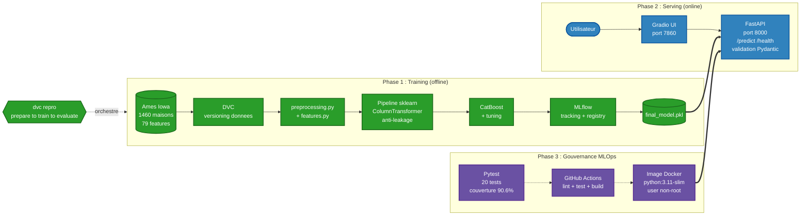
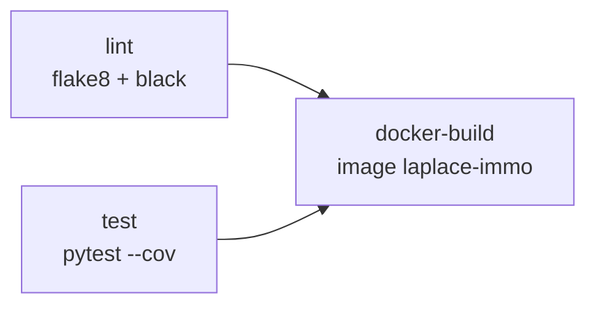

# Laplace Immo

[](https://github.com/dastou/projet_mlops_house_price/actions)
[](https://www.python.org/)
[](./tests)
[](./Dockerfile)
[](https://github.com/psf/black)

> Simulateur d'estimation de prix immobilier base sur le dataset Ames Iowa.
> Pipeline MLOps complet : DVC, MLflow, FastAPI, Gradio, Docker, GitHub Actions.

---

## Table des matieres

1. [Apercu](#1-apercu)
2. [Demo](#2-demo)
3. [Architecture](#3-architecture)
4. [Stack technique](#4-stack-technique)
5. [Donnees et feature engineering](#5-donnees-et-feature-engineering)
6. [Modeles et resultats](#6-modeles-et-resultats)
7. [Installation et lancement](#7-installation-et-lancement)
8. [Structure du projet](#8-structure-du-projet)
9. [Tests, qualite et CI/CD](#9-tests-qualite-et-cicd)
10. [Auteur](#10-auteur)

---

## 1. Apercu

### Le probleme

Une agence immobiliere veut estimer rapidement le prix d'une maison avant de la mettre en vente. Le jugement humain est variable et lent. L'objectif de **Laplace Immo** est de fournir aux agents un **simulateur de prix** base sur l'apprentissage automatique : ils saisissent les caracteristiques d'une maison (surface, quartier, annee, qualite, etc.), et obtiennent en quelques secondes une estimation accompagnee d'une fourchette de confiance.

### Pourquoi un projet MLOps complet

Un modele de Machine Learning n'a de valeur que s'il est **fiable, reproductible et maintenable** dans le temps. Le projet ne s'arrete donc pas a l'entrainement d'un modele. Il couvre toute la chaine :

- **Versionner** le code (Git), les donnees (DVC) et les experimentations (MLflow) pour pouvoir tracer chaque resultat.
- **Tester** automatiquement le code pour eviter qu'une modification ne casse l'API.
- **Conteneuriser** avec Docker pour deployer la meme application sur n'importe quel serveur.
- **Automatiser** avec une CI/CD (GitHub Actions) pour que chaque modification soit validee avant d'arriver en production.

C'est ce qu'on appelle un pipeline **MLOps** (Machine Learning Operations) : il transforme un notebook de data science en un service utilisable de maniere durable.

### Donnees utilisees

Le projet s'appuie sur le dataset public **Ames Iowa** : 1 460 maisons reelles vendues entre 2006 et 2010, decrites par 79 caracteristiques (surfaces, qualite, quartier, annee, equipements, etc.). Ce dataset est issu de la competition Kaggle [House Prices: Advanced Regression Techniques](https://www.kaggle.com/competitions/house-prices-advanced-regression-techniques), telecharge automatiquement via OpenML (id 42165).

### Resultat obtenu

Le modele final atteint un coefficient de determination **R² = 0.9214** : il explique **92% de la variation des prix** observee dans le dataset, avec une erreur moyenne d'environ **13 583 $** sur un prix moyen de 180 000 $ (soit environ 7,5% d'erreur). C'est un score qui placerait le modele dans le **top 5% du leaderboard Kaggle** sans technique avancee de stacking.

---

## 2. Demo

### Interface utilisateur Gradio

Une interface premium consommant l'API FastAPI, avec saisie progressive (caracteristiques principales + details optionnels + caracteristiques particulieres pour maisons atypiques).


### Documentation Swagger de l'API

Swagger UI auto-generee, accessible a `http://localhost:8000/docs`.


---

## 3. Architecture

Le projet s'organise autour des trois phases canoniques d'un cycle MLOps : entrainement hors-ligne, mise en production en ligne, gouvernance transverse (tests + CI/CD + conteneurisation).



### Legende

- **Phase 1 (vert) Training offline** : les donnees Ames Iowa sont versionnees avec DVC, traitees par un pipeline sklearn anti-fuite, puis utilisees pour entrainer CatBoost. MLflow trace chaque experimentation et exporte `final_model.pkl`. Toute la chaine est reproductible via `dvc repro`.
- **Phase 2 (bleu) Serving online** : l'utilisateur interagit avec l'interface Gradio, qui envoie ses requetes a l'API FastAPI. L'API valide les entrees via Pydantic et retourne la prediction.
- **Phase 3 (violet) Gouvernance MLOps** : les tests Pytest sont executes par GitHub Actions (jobs lint, test, docker-build avec dependances `needs:`), qui construit ensuite l'image Docker.
- **Fleches** : pleines pour le flux de donnees, doubles `==>` pour les artefacts livres en production, pointillees `-.->` pour les workflows automatises.

### Trois couches de preprocessing (anti-leakage)

1. `src/preprocessing.py` : operations deterministes applicables avant split (suppression outliers, NaN structurels en `"None"` ou `0`).
2. `src/features.py` : feature engineering deterministe (ages des batiments, surfaces totales, comptages composites, indicateurs binaires).
3. `src/pipeline.py` : transformations statistiques dans un `sklearn.Pipeline` (imputation par mediane de quartier, encodages, scaling). **Fittees uniquement sur le train**, garanti par `ColumnTransformer`.

---

## 4. Stack technique

Chaque outil a un role precis dans la chaine MLOps. Le tableau ci-dessous resume le **pourquoi** de chaque choix.

| Domaine | Outil | Role dans le projet |
|---------|-------|---------------------|
| Langage | Python 3.11 | Langage principal, standard du data science. |
| Manipulation de donnees | pandas 2.2, numpy 1.26 | Charger, nettoyer et transformer les donnees tabulaires. |
| Modeles ML | scikit-learn 1.5, CatBoost 1.2 | Construire le pipeline de preprocessing et entrainer le modele gagnant. |
| Modeles compares | XGBoost, LightGBM | Servent de baselines lors de l'etape de selection du meilleur modele. |
| Tracking d'experiences | MLflow 2.18 | Garde l'historique de chaque entrainement (parametres, metriques, modeles) pour comparer et choisir le meilleur. |
| Versionnement donnees | DVC 3.67 | Equivalent de Git pour les donnees et les modeles : trop volumineux pour Git, mais necessaires pour reproduire les resultats. |
| API REST | FastAPI 0.115 + Uvicorn | Expose le modele via une URL `POST /predict` que n'importe quelle application peut appeler. |
| Validation des entrees | Pydantic 2.10 | Verifie que les donnees envoyees a l'API ont les bons types et bornes (ex: pas de surface negative). |
| Interface utilisateur | Gradio 5.9 | Interface graphique pour qu'un agent saisisse les caracteristiques sans connaitre l'API. |
| Tests | Pytest + httpx | Verifient automatiquement que le code marche apres chaque modification. |
| Qualite de code | black, flake8 | Formatent et linent le code selon les standards PEP 8. |
| Conteneurisation | Docker (python:3.11-slim) | Empaquete l'API + ses dependances pour la deployer partout a l'identique. |
| CI/CD | GitHub Actions | Lance automatiquement lint + tests + build Docker a chaque modification du code. |

---

## 5. Donnees et feature engineering

### Source des donnees

Le dataset est telecharge automatiquement depuis OpenML (pas de token Kaggle requis, portable en CI). Il contient 1 460 maisons d'Ames (Iowa) decrites par 79 variables explicatives + la cible `SalePrice`.

### Transformations appliquees

**Cible (le prix)** : on entraine le modele a predire `log(prix)` au lieu de `prix` directement, puis on convertit en dollars au moment de l'estimation. Pourquoi ? La distribution des prix immobiliers est tres asymetrique (beaucoup de maisons abordables, quelques manoirs chers). Le passage en logarithme rend la distribution beaucoup plus symetrique (skewness de 1.88 a 0.12), ce qui ameliore les performances du modele. C'est aussi la metrique officielle de la competition Kaggle.

**Variables exclues** : 4 variables ont ete retirees du jeu d'entrainement car elles ne sont **pas disponibles au moment de l'estimation** (avant la vente) : `SaleType`, `SaleCondition`, `MoSold` et `YrSold`. Les utiliser creerait un "data leakage" metier : le modele apprendrait avec des informations futures inaccessibles en production.

**11 nouvelles features creees** :

| Famille | Features |
|---------|----------|
| Surfaces totales | `TotalSF`, `TotalPorchSF` |
| Comptages composites | `TotalBathrooms` (pondere les demi-SdB a 0.5) |
| Ages | `building_age`, `remodel_age`, `garage_age` |
| Indicateurs binaires | `has_pool`, `has_garage`, `has_basement`, `has_fireplace`, `has_2ndfloor` |

### Pipeline DVC reproductible

Trois etapes versionnees dans `dvc.yaml` :

```bash
dvc repro    # rejoue le pipeline complet : prepare -> train -> evaluate
dvc dag      # affiche le graphe des dependances
```

Le pipeline complet tourne en environ 12 secondes grace au cache DVC.

---

## 6. Modeles et resultats

### Comparaison de 11 modeles

11 algorithmes ont ete compares dans le notebook [house_price_03_essais.ipynb](notebooks/house_price_03_essais.ipynb), du plus simple (regression lineaire) aux plus avances (gradient boosting). Chaque entrainement est trace dans MLflow avec ses parametres, sa duree et ses metriques, ce qui permet de comparer objectivement les modeles.

### Modele gagnant : CatBoost tune

CatBoost a ete selectionne pour deux raisons principales :

1. **Performances** : meilleur score sur la metrique cible (RMSE log).
2. **Gestion native des variables categorielles** : `Neighborhood`, `Foundation` et autres variables qualitatives sont encodees automatiquement par le modele, ce qui evite les transformations manuelles (OneHotEncoder, OrdinalEncoder).

**Hyperparametres** (optimises par `RandomizedSearchCV` : 30 combinaisons testees, validation croisee a 5 plis) :

```yaml
iterations: 1200       # nombre d'arbres construits
depth: 5               # profondeur maximale de chaque arbre
learning_rate: 0.05    # vitesse d'apprentissage
l2_leaf_reg: 7         # regularisation L2 pour eviter le surapprentissage
```

### Performances finales sur le jeu de test

| Metrique | Valeur | Interpretation |
|----------|--------|----------------|
| **R²** | **0.9214** | Le modele explique 92.1% de la variation des prix. |
| **RMSE log** | **0.1151** | Erreur sur le log des prix (metrique Kaggle officielle). |
| **RMSE en dollars** | **19 003 $** | Ecart-type des erreurs en dollars. |
| **MAE en dollars** | **13 583 $** | Erreur absolue moyenne, soit ~7,5% du prix moyen (180 000 $). |

Pour reference, ce score (RMSE log < 0.12) placerait le modele dans le **top 5% du leaderboard Kaggle** de la competition House Prices, sans avoir recours au stacking.

> **Insight cle du projet** : la majeure partie de la performance vient du **preprocessing et du feature engineering**, pas du tuning des hyperparametres. Entre un CatBoost avec parametres par defaut et la version optimisee, le gain est minime (R² passe de 0.9211 a 0.9214). En revanche, ajouter les 11 features creees (`TotalSF`, `building_age`, `has_garage`, etc.) ameliore significativement les performances. Lecon a retenir : investir dans la qualite des donnees est plus rentable que d'optimiser le modele.

---

## 7. Installation et lancement

Le projet propose **3 modes d'utilisation** selon ton objectif. Chacun commence par les memes pre-requis communs.

### Pre-requis communs

- **Python 3.11** : installation recommandee via Anaconda ou Miniconda.
- **Git** : pour cloner le depot.
- **Docker Desktop** : uniquement si tu veux executer le Mode 3.

Avant de choisir un mode, executer ces 3 etapes une seule fois :

```bash
# 1. Cloner le depot
git clone https://github.com/dastou/projet_mlops_house_price.git
cd projet_mlops_house_price

# 2. Creer et activer l'environnement Python
conda create -n mlops_immo python=3.11 -y
conda activate mlops_immo

# 3. Installer les dependances
pip install -r requirements.txt
```

Choisir ensuite l'un des 3 modes ci-dessous selon le besoin.

---

### Mode 1 : Demarrage rapide (utiliser le simulateur)

Le cas le plus courant : voir l'interface tourner et tester des estimations.

Dans un **premier terminal**, lancer l'API :

```bash
uvicorn api.main:app --reload
```

L'API est accessible sur `http://localhost:8000` :
- `/docs` : documentation Swagger interactive
- `/health` : healthcheck (renvoie `{"status":"ok","model_loaded":true}`)
- `POST /predict` : endpoint d'estimation

Dans un **second terminal** (en gardant le premier ouvert), lancer l'interface Gradio :

```bash
python ui/app.py
```

Acces a l'interface : `http://localhost:7860`. Un navigateur s'ouvre automatiquement.

---

### Mode 2 : Reproduire le pipeline et explorer les notebooks

Pour comprendre comment le modele a ete construit, ou pour le re-entrainer.

**Explorer les notebooks dans l'ordre** :

```bash
jupyter notebook
```

Puis ouvrir successivement :
1. `notebooks/house_price_01_analyse.ipynb` : analyse exploratoire (EDA).
2. `notebooks/house_price_02_preprocessing.ipynb` : nettoyage et feature engineering.
3. `notebooks/house_price_03_essais.ipynb` : comparaison de 11 modeles avec tracking MLflow.
4. `notebooks/house_price_04_final.ipynb` : tuning du modele final et sauvegarde du `.pkl`.

**Reproduire le pipeline DVC** :

```bash
dvc repro    # rejoue les 3 stages : prepare -> train -> evaluate
dvc dag      # affiche le graphe des dependances entre les stages
```

`dvc repro` telecharge les donnees depuis OpenML, applique le preprocessing, entraine le modele et evalue les metriques. Le fichier `models/final_model.pkl` est regenere a l'identique en environ 12 secondes grace au cache DVC.

**Visualiser les experimentations MLflow** :

```bash
mlflow ui
```

Acces : `http://localhost:5000`. Permet de comparer les 11 modeles testes avec leurs hyperparametres et metriques.

---

### Mode 3 : Deploiement avec Docker

Pour deployer l'API sur n'importe quel serveur ou tester l'image conteneurisee.

**Construire l'image** :

```bash
docker build -t laplace-immo .
```

Le build dure environ 3 minutes au premier lancement. L'image fait ~763 MB et contient uniquement ce qui est necessaire pour servir l'API en production (pas les notebooks, ni l'interface Gradio, ni les dependances de developpement).

**Lancer le container** :

```bash
docker run -p 8000:8000 laplace-immo
```

L'API est accessible sur `http://localhost:8000/docs`. Un healthcheck s'execute automatiquement toutes les 30 secondes pour verifier que le modele est bien charge en memoire.

---

## 8. Structure du projet

```
projet_mlops/
├── api/                          # API FastAPI
│   ├── main.py                   # endpoints /health et /predict
│   └── schemas.py                # modeles Pydantic (75 champs)
├── data/                         # donnees versionnees par DVC
│   ├── raw/                      # ames.csv (OpenML)
│   └── processed/                # X_train.pkl, X_test.pkl, y_train.pkl, y_test.pkl
├── docs/
│   └── img/                      # captures pour le README
├── metrics/
│   └── metrics.json              # metriques DVC (R², RMSE, MAE)
├── models/
│   └── final_model.pkl           # modele CatBoost serialise (752 KB)
├── notebooks/
│   ├── house_price_01_analyse.ipynb         # EDA
│   ├── house_price_02_preprocessing.ipynb   # nettoyage + FE
│   ├── house_price_03_essais.ipynb          # 11 modeles + MLflow
│   └── house_price_04_final.ipynb           # tuning final + sauvegarde
├── src/
│   ├── data.py                   # chargement OpenML
│   ├── preprocessing.py          # nettoyage deterministe
│   ├── features.py               # feature engineering
│   ├── pipeline.py               # Pipeline sklearn anti-leakage
│   └── stages/                   # scripts DVC (prepare, train, evaluate)
├── tests/
│   ├── conftest.py               # fixtures pytest
│   ├── fixtures/                 # echantillon CSV pour la CI
│   ├── test_data.py              # 3 tests
│   ├── test_preprocessing.py     # 5 tests
│   ├── test_features.py          # 5 tests
│   ├── test_pipeline.py          # 3 tests
│   └── test_api.py               # 4 tests
├── ui/
│   ├── app.py                    # interface Gradio
│   └── defaults.py               # valeurs par defaut des 75 champs
├── .github/
│   └── workflows/ci.yml          # workflow GitHub Actions
├── Dockerfile                    # image API minimaliste
├── dvc.yaml                      # pipeline DVC (3 stages)
├── params.yaml                   # hyperparametres CatBoost
├── pyproject.toml                # config black
├── .flake8                       # config flake8
├── requirements.txt              # dependances completes
├── requirements-api.txt          # dependances API (Docker)
└── requirements-dev.txt          # dependances de developpement
```

---

## 9. Tests, qualite et CI/CD

### Pourquoi tester du code de Machine Learning ?

Un projet ML n'est pas seulement un modele : c'est aussi du code de preprocessing, de feature engineering, et une API qui prend des inputs et retourne une prediction. Si une modification casse l'une de ces parties (par exemple : on change une regle de nettoyage et tous les modeles entraines apres deviennent faux), il faut le detecter **immediatement**, pas en production. C'est le role des **tests automatises**.

### Tests Pytest

Le projet contient **20 tests** repartis en 5 fichiers, avec une **couverture de 90.6%** du code :

```bash
pytest tests/ -v --cov=src --cov=api
```

| Fichier | Tests | Verifie |
|---------|-------|---------|
| `test_data.py` | 3 | Le chargement du dataset et la separation features/cible. |
| `test_preprocessing.py` | 5 | Les regles de nettoyage (outliers, NaN). |
| `test_features.py` | 5 | Le calcul correct des nouvelles features. |
| `test_pipeline.py` | 3 | Le pipeline sklearn complet (pas de NaN, predictions plausibles). |
| `test_api.py` | 4 | Les endpoints REST (`/health`, `/predict`, validation des inputs). |

**Astuce** : pour eviter de dependre d'Internet en CI, les fixtures session-scoped chargent un **echantillon stratifie local** ([tests/fixtures/house_prices_sample.csv](tests/fixtures/house_prices_sample.csv), 98 lignes representatives, les 25 quartiers couverts). Les tests sont rapides (~5 secondes au total) et fonctionnent meme sans connexion reseau.

### Qualite de code

Deux outils maintiennent un code propre et lisible :

- **black** (formateur) : reformate automatiquement le code pour suivre un style coherent : `black src/ api/ tests/`.
- **flake8** (linter) : signale les erreurs courantes (imports inutilises, variables non utilisees) : `flake8 src/ api/ tests/`.

La configuration utilise une limite de 100 caracteres par ligne, compatible black (les regles E203 et W503 sont ignorees pour eviter les conflits entre les deux outils).

### Pipeline CI/CD GitHub Actions

A chaque `git push` sur `main` (ou ouverture d'une pull request), GitHub lance automatiquement un robot qui execute trois jobs ([.github/workflows/ci.yml](.github/workflows/ci.yml)) :



| Job | Role |
|-----|------|
| `lint` | Verifie le formatage et signale les erreurs de style. |
| `test` | Execute les 20 tests Pytest et mesure la couverture. |
| `docker-build` | Construit l'image Docker (depend du succes de `lint` et `test`). |

Si un test echoue ou si le formatage n'est pas correct, le robot affiche un drapeau rouge sur le commit. La modification ne peut pas etre integree tant que tout n'est pas vert. C'est ce qu'on appelle un **garde-fou automatique**.

Le cache pip et le cache Docker GHA accelerent les executions suivantes (premiere execution : ~3 min, executions suivantes : ~1 min).

---

## 10. Auteurs

**Astou DIALLO** et **Ousmane SALL**
Etudiants en Master DIC3, [Ecole Polytechnique de Thies](https://www.ept.sn) (Senegal)
Projet realise dans le cadre du module MLOps, 2026.

