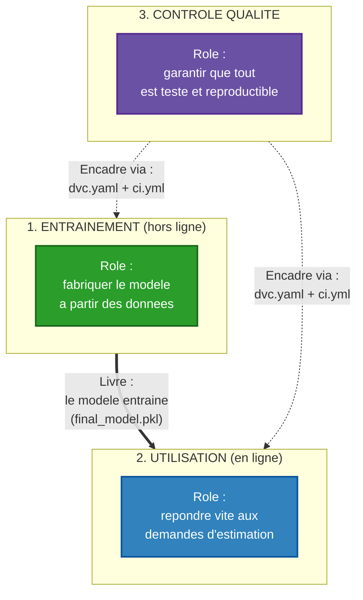
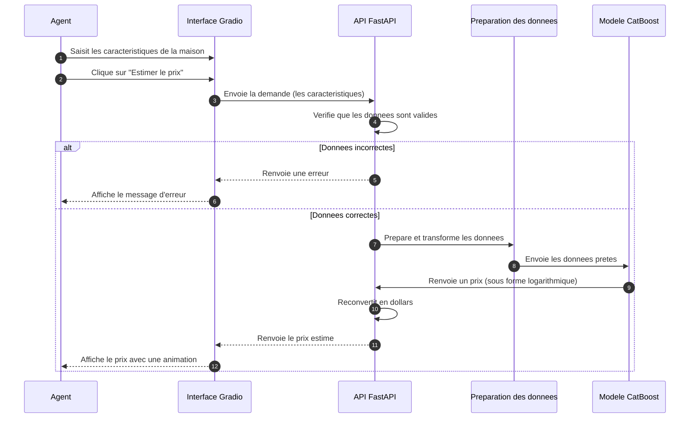

# Documentation d'architecture : Laplace Immo

> Le [README](../README.md) explique **comment** installer et lancer le projet.
> Ce document explique **pourquoi** chaque outil a été choisi.

---

## Table des matières

1. [Les règles que le projet doit respecter](#1-les-règles-que-le-projet-doit-respecter)
2. [Vue d'ensemble du système](#2-vue-densemble-du-système)
3. [Pourquoi chaque outil a été choisi](#3-pourquoi-chaque-outil-a-été-choisi)
4. [Le parcours d'une estimation, de A à Z](#4-le-parcours-dune-estimation-de-a-à-z)
5. [Éviter la triche du modèle (data leakage)](#5-éviter-la-triche-du-modèle-data-leakage)
6. [Ce que le projet ne fait pas encore](#6-ce-que-le-projet-ne-fait-pas-encore)
7. [Tableau récapitulatif des choix](#7-tableau-récapitulatif-des-choix)

---

## 1. Les règles que le projet doit respecter

Tous les choix techniques découlent de ces règles :

- **Estimation avant la vente.** On estime le prix d'une maison avant qu'elle soit vendue. Interdiction d'utiliser des informations connues seulement après la vente (type de vente, date de vente) : ce serait de la triche.
- **Utilisateur non informaticien.** L'interface est faite pour des agents immobiliers. La saisie doit être rapide et sans mots techniques.
- **Tests sans internet.** Les tests automatiques doivent fonctionner même sans connexion, pour ne pas échouer à cause d'une panne de réseau.
- **Un seul utilisateur, un seul ordinateur.** Pas de serveur cloud, pas de mot de passe à configurer.
- **Simple d'abord.** Si une solution simple suffit, on ne rajoute pas de complexité inutile.

---

## 2. Vue d'ensemble du système

Le projet se divise en trois parties. Chacune a un seul rôle.

- **L'Entraînement** fabrique le fichier modèle (`final_model.pkl`). C'est le seul lien avec la partie Utilisation.
- **L'Utilisation** reçoit les demandes et renvoie les prix, via l'API et l'interface.
- **Le Contrôle qualité** encadre le tout avec les tests automatiques et le pipeline reproductible.

Avantage : on peut changer une partie sans casser les autres. Par exemple, remplacer le modèle ne casse pas l'interface tant que le format des données reste le même.

---

## 3. Pourquoi chaque outil a été choisi

### Les données

**OpenML (source des données).** On télécharge le jeu de données Ames depuis OpenML plutôt que Kaggle : OpenML marche sans compte ni clé d'accès, donc tout est reproductible sans configuration. Les données sont identiques à celles de Kaggle.

**DVC (versionnement des données).** Git est fait pour du texte, pas pour de gros fichiers de données. DVC garde les versions des données et du modèle, décrit les étapes de fabrication, et évite de tout recalculer quand seule une partie change. Git LFS, l'alternative, ne fait que du stockage.

**Échantillon de test (98 maisons).** Les tests automatiques utilisent un petit échantillon gardé dans le projet, avec au moins une maison de chaque quartier, au lieu de télécharger les données à chaque fois. Résultat : des tests rapides et sans dépendance à internet.

### La fabrication du modèle

**Code de préparation en 3 étages.** Le nettoyage est séparé en trois fichiers (détail en section 5) pour garantir que les calculs qui apprennent des données ne voient jamais les données de test.

**Logarithme sur le prix.** Les prix immobiliers sont très étalés (beaucoup de maisons moyennes, quelques très chères). Le logarithme tasse cette distribution, ce qui aide le modèle à apprendre. C'est aussi la méthode officielle de la compétition Kaggle.

**CatBoost (modèle final).** Choisi après comparaison de 11 modèles. Le jeu de données contient beaucoup de variables texte (quartier, type de toit...) et CatBoost sait les traiter tout seul, là où XGBoost ou LightGBM demandent une préparation en plus.

**Trois mesures de qualité.** Le R² dit quelle part du prix est bien expliquée, le RMSE pénalise les grosses erreurs, le MAE donne l'erreur moyenne en dollars, parlante pour un agent immobilier.

### Le suivi des expériences

**MLflow (en local).** Garde une trace de chaque essai de modèle (réglages, résultats) pour comparer les 11 modèles testés. La version locale suffit : pas de serveur, pas de mot de passe.

**Pipeline DVC en 3 étapes.** `prepare` prépare les données, `train` entraîne, `evaluate` mesure la qualité. Si on change un réglage du modèle, seules les deux dernières étapes sont relancées : gain de temps.

### L'interface et l'API

**FastAPI (API).** Le serveur qui reçoit une demande et renvoie un prix. FastAPI vérifie automatiquement les données reçues, génère sa documentation tout seul (page `/docs`) et est plus rapide que Flask.

**Pydantic (vérification des entrées).** Vérifie chaque donnée reçue : une surface ne peut pas être négative, une note de qualité va de 1 à 10. Les valeurs absurdes sont bloquées avant d'atteindre le modèle.

**Gradio (interface).** L'interface web où l'agent saisit les caractéristiques. Gradio garde le modèle en mémoire, donc les réponses sont rapides. Streamlit, l'alternative la plus connue, recharge tout à chaque clic.

**Champs importants d'abord.** L'interface montre 8 à 10 champs principaux (surface, quartier, qualité...) et cache le reste dans des sections dépliables. C'est ce que font Zillow ou MeilleursAgents : on ne noie pas l'utilisateur sous 80 champs.

### La mise en boîte et les tests automatiques

**Docker (image python:3.11-slim).** Docker met l'application dans une "boîte" qui tourne partout pareil. La version "slim" est allégée tout en restant compatible avec les bibliothèques de machine learning, contrairement à "alpine" qui les casse souvent.

**Sécurité du conteneur.** L'application tourne avec un compte limité (pas administrateur) et un contrôle automatique vérifie toutes les 30 secondes qu'elle répond bien.

**Pytest (tests).** 20 tests couvrent 90.6% du code. Pytest est l'outil standard en Python.

**CI en 3 étapes.** À chaque modification envoyée sur GitHub, trois vérifications s'enchaînent : style du code, tests, construction de l'image Docker. Trois étapes séparées permettent de voir tout de suite ce qui a échoué.

**Modèle gardé dans Git.** Le fichier du modèle (752 Ko) est petit, donc on le garde directement dans le projet. Cela évite de configurer un stockage cloud juste pour les tests automatiques. Dans un projet d'entreprise, on utiliserait un stockage dédié.

**Black + Flake8 (style du code).** Black met le code en forme automatiquement, Flake8 signale les erreurs. Ce sont les outils les plus connus et les mieux documentés.

---

## 4. Le parcours d'une estimation, de A à Z

Ce schéma suit une demande d'estimation, depuis le clic de l'agent jusqu'à l'affichage du prix.

Trois points importants :

- **Rapidité** : le modèle est chargé une seule fois au démarrage de l'API, pas à chaque demande. Une estimation prend moins d'un dixième de seconde.
- **Sécurité** : les valeurs absurdes sont rejetées avant d'arriver au modèle.
- **Transformation cachée** : le modèle travaille en logarithme, l'API reconvertit en dollars. L'agent ne voit jamais cette étape.

---

## 5. Éviter la triche du modèle (data leakage)

Le "data leakage" (fuite de données) est une erreur fréquente : sans faire attention, on donne au modèle des informations qu'il n'aurait pas dans la vraie vie. Il semble alors excellent pendant les tests, mais devient mauvais en conditions réelles.

Pour éviter ce piège, le code de préparation est séparé en trois étages :

| Étage | Fichier | Ce qu'il fait | Risque de fuite |
|-------|---------|---------------|-----------------|
| 1 | `src/preprocessing.py` | Nettoyage simple (supprimer des colonnes, corriger des types) | Aucun |
| 2 | `src/features.py` | Calculs simples (âges, surfaces totales) | Aucun |
| 3 | `src/pipeline.py` | Calculs qui apprennent des données (remplir les trous, encoder, mettre à l'échelle) | Élevé si mal fait |

Un exemple concret : pour remplir une valeur manquante, on utilise souvent la médiane. Si on la calcule sur **toutes** les données (entraînement + test), on donne au modèle un indice sur les données de test. La bonne méthode la calcule **uniquement** sur les données d'entraînement. L'outil sklearn force cette discipline automatiquement dans l'étage 3.

Cette rigueur fait la différence entre un résultat honnête (environ 92% de variance expliquée, notre cas) et un résultat artificiellement gonflé qui s'effondrerait en utilisation réelle.

---

## 6. Ce que le projet ne fait pas encore

Par honnêteté, voici ce que l'architecture ne couvre pas :

- **Pas de surveillance dans le temps.** Le modèle ne détecte pas si le marché immobilier change. Dans un vrai projet, on ajouterait un outil comme Evidently.
- **Pas de ré-entraînement automatique.** Le modèle n'est pas remis à jour tout seul.
- **Suivi des expériences non partagé.** Les résultats MLflow restent sur l'ordinateur local.

Ces ajouts ne sont pas nécessaires dans le cadre actuel (règle "simple d'abord"), mais l'architecture permet de les brancher plus tard sans tout refaire.

---

## 7. Tableau récapitulatif des choix

| Élément | Choix | Principale alternative écartée | Raison principale |
|---------|-------|-------------------------------|-------------------|
| Source des données | OpenML | Kaggle | Marche sans compte |
| Versionnement données | DVC | Git LFS | Suit les étapes + évite de recalculer |
| Données pour les tests | Échantillon de 98 maisons | Tout télécharger | Tests sans internet |
| Code de préparation | 3 étages séparés | Un seul gros fichier | Éviter la triche du modèle |
| Transformation du prix | Logarithme | Aucune | Aide le modèle + standard Kaggle |
| Modèle final | CatBoost | XGBoost | Gère le texte tout seul |
| Mesures de qualité | R² + RMSE + MAE | Une seule | Trois angles complémentaires |
| Suivi des expériences | MLflow local | Service cloud | Pas de mot de passe |
| Enchaînement des étapes | DVC 3 stages | Une seule étape | Évite de tout recalculer |
| API | FastAPI | Flask | Vérification auto + documentation |
| Vérification des entrées | Pydantic | À la main | Bloque les valeurs absurdes |
| Interface | Gradio | Streamlit | Réponses plus rapides |
| Formulaire | Champs importants d'abord | Tout afficher | Plus simple pour l'agent |
| Image Docker | python:3.11-slim | Alpine | Compatible avec les calculs ML |
| Sécurité Docker | Compte limité + contrôle de santé | Compte administrateur | Bonnes pratiques |
| Tests | Pytest | Autres outils | Standard Python |
| Tests automatiques | 3 étapes | Une seule | Voir vite ce qui échoue |
| Stockage du modèle | Dans Git | Stockage cloud | Pas de mot de passe |
| Style du code | Black + Flake8 | Ruff | Les plus connus |

---

*Projet MLOps Laplace Immo, Master DIC3, École Polytechnique de Thiès, 2026.*
